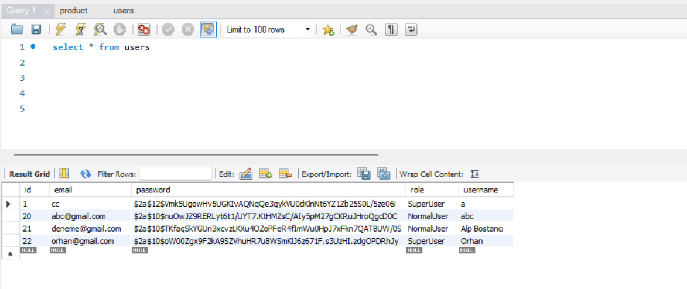
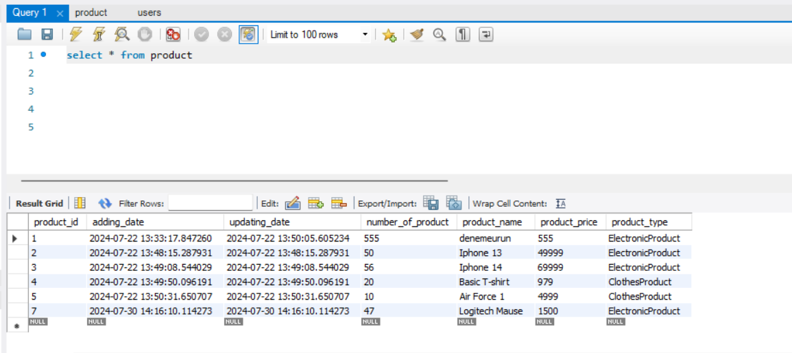

# E-Commerce Application - Spring Boot Backend + Docker

This project was created to develop the backend of an e-commerce platform using Java Spring Boot. The application includes basic features such as user management, product management, and authorization, and uses a MySQL database. Docker integration is also provided so that the application can be easily deployed and run using Docker.

    Project Structure:

    -config: Application configuration files and settings.
    -dto: Data Transfer Objects (DTO) and request/response objects.
    -model: Entity classes representing database tables.
    -repository: JPA repository interfaces used for database operations.
    -service: Business logic and service layer.
    -controller: RESTful controllers defining API endpoints.

    Technologies Used:

    -Java 17: Main programming language.
    -Spring Boot 3.3.1: Framework for fast and easy development.
    -Spring Data JPA: JPA-based solution for database operations.
    -MySQL: Database solution.
    -Docker: For application containerization and deployment.
    -Gradle: Project management and dependency management.

## Veritabanı Tabloları

### User Tablosu
User tablosu, kullanıcı bilgilerini saklamak için kullanılır.

### Product Tablosu
Product tablosu, ürün bilgilerini saklamak için kullanılır.

    Database Configuration:

    The application uses MySQL as the database.
    Database connection details should be configured in the application.properties file.

    Properties:
    
    -User Management: User registration, login, authorization and authorization with roles (SuperUser, NormalUser).
    -Product Management: Add, update, delete and list products.
    -Authorization: Secure API access using JWT.